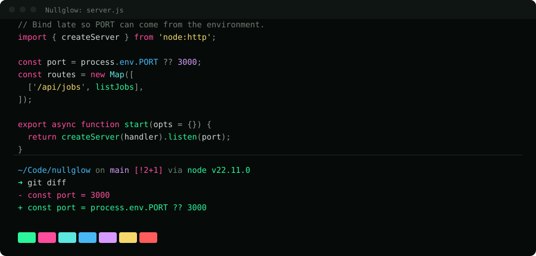
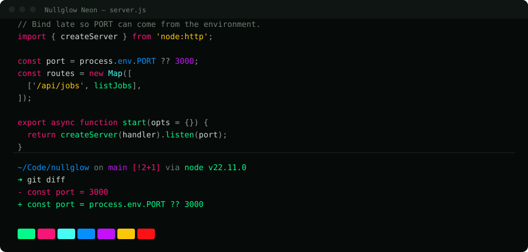

# Nullglow

A near-black theme for the terminal and the editor. Tuned, not eyeballed.

Two variants. Every colour in both clears WCAG AA against the background, and no two
accents collapse into each other for a colour-blind reader. The repo ships the checker
that proves it.

### Nullglow



### Nullglow Neon



Same neutrals in both. Neon pushes the accents as far as the rules allow. It's the louder
one. Nullglow is easier to sit in front of all day.

## Why another dark theme

Most themes pick colours by eye. This one derives them from three rules.

| Rule | Threshold | Why |
|---|---|---|
| Contrast against the background | 4.5:1 (WCAG AA) | including `comment`, which most themes let fail |
| Distance between accents | ΔE 25 | so two roles never read as the same colour |
| Distance under deuteranopia | ΔE 18 | so red/green deficiency doesn't flatten the palette |

Neon's values came out of a search over 240,000 candidates for the most saturated palette
that still passes all three. It's more vivid than the hand-picked palette it replaced:
mean CIELAB chroma 81.7 against 70.6. The stock values everyone reaches for, `#00ff88`
and `#00ffff` and `#ff0080`, aren't actually the most saturated points available.

You don't have to take my word for any of it:

```console
$ python3 build.py --check
── Nullglow ──
  contrast against ground (#060b09), need >= 4.5:1
    comment  #6e7d71    4.56:1  pass
    ...
  accent separation, need ΔE >= 25
    worst pair: pink/red  ΔE 40.5  pass
  separation under deuteranopia, need ΔE >= 18
    worst pair: cyan/purple  ΔE 22.8  pass
  verified
...
All variants meet the spec.
```

It exits non-zero if a value regresses.

## Roles, not colours

A colour is defined once, as a role, and means the same thing everywhere.

| Role | Nullglow | Neon | Means |
|---|---|---|---|
| `green` | `#2bf59b` | `#05f98b` | functions, prompt arrow, additions |
| `pink` | `#ff4d9e` | `#f81578` | keywords, git-dirty, deletions |
| `cyan` | `#5ce6e0` | `#45fdf3` | types, links, timestamps |
| `blue` | `#48b8f5` | `#0690fc` | paths, properties |
| `purple` | `#d79bff` | `#c312f9` | constants, untracked |
| `yellow` | `#f5d76b` | `#fcc60b` | strings, command duration |
| `red` | `#ff5c5c` | `#fe1115` | errors only |
| `ground` | `#060b09` | `#060b09` | background |
| `fg` | `#cfd8d3` | `#cfd8d3` | body text |
| `comment` | `#6e7d71` | `#6e7d71` | comments, ghost text |

Pink means deleted in a diff, dirty in the prompt, keyword in the editor. That's the
reason everything is generated from one file instead of maintained by hand. Hand-kept
theme repos drift.

## What's included

| Target | File | Verified |
|---|---|---|
| VS Code | `dist/vscode/` | yes, both variants in the picker |
| Terminal.app | `dist/terminal-app/*.terminal` | yes |
| iTerm2 | `dist/iterm2/*.itermcolors` | **no.** I don't have iTerm2. It lints, nothing more |
| bat | `dist/bat/*.tmTheme` | yes |
| delta | `dist/delta/*.gitconfig` | yes |
| starship | `dist/starship/*.toml` | yes |
| zsh: fzf, highlighting, completion, history | `dist/zsh/*-theme.zsh` | yes |
| vivid, for `LS_COLORS` | `dist/vivid/*.yml` | yes |

## Install

```sh
git clone https://github.com/mahoudeau/nullglow.git
cd nullglow
./install.sh          # Nullglow
./install.sh --neon   # Nullglow Neon
```

It backs up anything it overwrites into `.backup/` and skips tools you don't have. It
won't edit your shell rc or your gitconfig. Instead it asks you to add two lines, once:

```zsh
# end of ~/.zshrc, after compinit and after the plugins load
source ~/.config/nullglow/theme.zsh
```
```ini
# ~/.gitconfig
[include]
    path = ~/.config/nullglow/delta.gitconfig
```

That's it. `theme.zsh` owns bat, `LS_COLORS`, fzf, syntax highlighting, autosuggestions,
the completion menu and history search. Switching between the variants after that is
re-running the script, not editing anything. `./install.sh --uninstall` puts the backups
back.

### By hand

<details>
<summary>Per-tool instructions</summary>

**VS Code.** Copy `dist/vscode/` to `~/.vscode/extensions/nullglow-theme/`, reload the
window, pick the theme.

**bat.** Copy `dist/bat/*.tmTheme` into `$(bat --config-dir)/themes/`, run
`bat cache --build`, then `export BAT_THEME="Nullglow"`. bat takes the theme name from the
filename, so keep the spaces.

**delta.** Add to `~/.gitconfig`:
```ini
[include]
    path = /path/to/nullglow/dist/delta/nullglow.gitconfig
```
delta reads its syntax theme from bat, so do bat first.

**starship.** Copy `dist/starship/nullglow.toml` to `~/.config/starship.toml`.

**vivid.** Copy `dist/vivid/*.yml` into `~/.config/vivid/themes/`. `theme.zsh` turns them
into `LS_COLORS`, or do it yourself with `export LS_COLORS="$(vivid generate nullglow)"`.

**zsh.** Copy `dist/zsh/nullglow-theme.zsh` to `~/.config/nullglow/theme.zsh` and source
it at the end of your `.zshrc`. It has to come after `compinit` and after the plugins
load, because it sets styles they own.

**Terminal.app.** Double-click `dist/terminal-app/Nullglow.terminal`, then Terminal >
Settings > Profiles > Nullglow > Default.

**iTerm2.** Settings > Profiles > Colors > Color Presets > Import, then pick
`dist/iterm2/Nullglow.itermcolors`. Untested. Open an issue if it's wrong.

</details>

## Build from source

`dist/` is committed, so you don't need anything to use the theme. To change a colour,
edit `palette.json` and regenerate. Python 3.9 or later, standard library only:

```sh
python3 build.py          # regenerate every target
python3 build.py --check  # re-verify the palette
```

Adding a platform means writing one emitter in `build.py`. PRs welcome, particularly for
the target marked unverified above.

## Credits

The look started with [0daybeats.com](https://www.0daybeats.com). None of their colour
values are in here. Every value was re-derived under the rules above, and the search
excludes their exact hexes. Credit for the direction anyway.

[hardhackerlabs/themes](https://github.com/hardhackerlabs/themes) showed that a theme like
this can take accessibility seriously.

## License

MIT. See [LICENSE](LICENSE).
